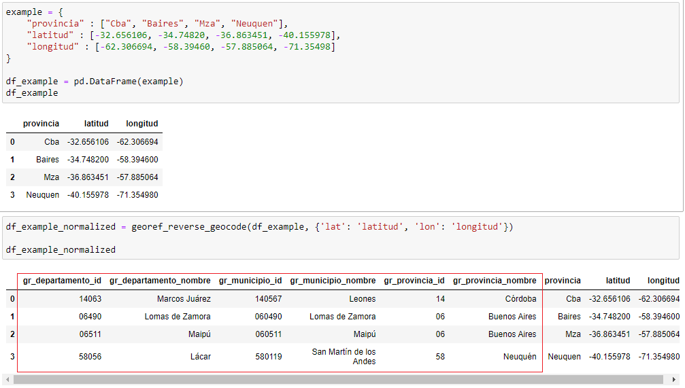

# Alkemy Challenge 

This is a data analytics challenge with python to enter the acceleration provided by [Alkemy](https://www.alkemy.org/).

## Instalations steps

These instructions will get you a copy of the project up and running on your local machine for development and testing purposes. 

```
git clone git@github.com:aguyanzon/alkemy_challenge.git
pip install virtualenv
python -m virtualenv env
env\Scripts\activate for Windows or source env/bin/activate for Linux/Mac
pip install -r requirements.txt

```

## Postgresql configuration

The .env file contains the parameters to access the database. Change them to your own database configuration.

## Configure logging level

The .env file contains a parameter named LOG_INFO. Change it to set your own log level value.

## Data normalization

For the normalization of the data, is used the API of the Geographic Data Normalization Service extracted from [datos.gob.ar](https://datosgobar.github.io/georef-ar-api/).

In this project, the latitude and longitude data are used to feed the API and it returns the names of the provinces, and in the case of museums, the id of the different departments.

Example:




